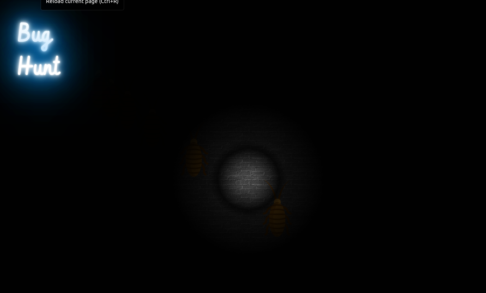

# Bug Hunt

An idea for a playful take on darkmode. The lights are out and you have just your flashlight to find your way in the dark... and you are not alone!

The cockroaches will scurry away from the light.

NOTE: You should be able to move the light around on touchscreen too although I only tried this in dev tools.

## Acknowledgements

- Neon light effect idea from [css-tricks.com](https://css-tricks.com/how-to-create-neon-text-with-css/)
- Background texture from [transparenttextures.com](https://www.transparenttextures.com/)
- Cockroach SVG from [svgrepo.com](https://www.svgrepo.com/svg/202858/cockroach)

## Improvements

### Bug direction

PROBLEM

The bugs mostly travel towards the bottom right and get pushed outside the screen.

IDEA

Make it so that they move all over and can't be pushed off the screen.

Temporary solution: I reset the bugs inside a setInterval so they don't stay off the screen.
